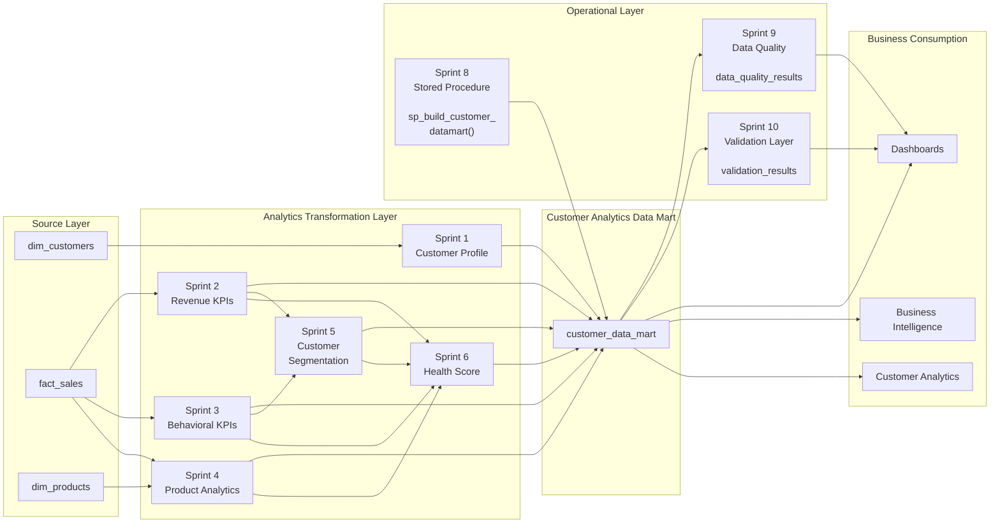

# Architecture - Customer Analytics Data Mart

```mermaid
%%{init: {
  "theme": "default",
  "themeVariables": {
    "fontSize": "22px"
  }
}}%%

flowchart LR

%% =============================================================================
%% SOURCE LAYER
%% =============================================================================

subgraph SOURCE["Source Layer"]

CUST["dim_customers"]
SALES["fact_sales"]
PROD["dim_products"]

end


%% =============================================================================
%% ANALYTICS LAYER
%% =============================================================================

subgraph ANALYTICS["Analytics Transformation Layer"]

S1["Sprint 1<br/>Customer Profile"]

S2["Sprint 2<br/>Revenue KPIs"]

S3["Sprint 3<br/>Behavioral KPIs"]

S4["Sprint 4<br/>Product Analytics"]

S5["Sprint 5<br/>Customer 
Segmentation"]

S6["Sprint 6<br/>Health Score "]

end


%% =============================================================================
%% DATA MART
%% =============================================================================

subgraph MART["Customer Analytics Data Mart"]

DM["customer_data_mart"]

end


%% =============================================================================
%% OPERATIONAL LAYER
%% =============================================================================

subgraph OPS["Operational Layer"]

SP["Sprint 8<br/>Stored Procedure<br/><br/>sp_build_customer_
datamart()"]

DQ["Sprint 9<br/>Data Quality<br/><br/>data_quality_results"]

VAL["Sprint 10<br/>Validation Layer<br/><br/>validation_results"]

end


%% =============================================================================
%% CONSUMPTION
%% =============================================================================

subgraph CONSUMPTION["Business Consumption"]

REPORT["Dashboards"]

BI["Business Intelligence"]

ANALYTICS_APP["Customer Analytics"]

end


%% =============================================================================
%% FLOW
%% =============================================================================

CUST --> S1
SALES --> S2
SALES --> S3

SALES --> S4
PROD --> S4

S1 --> DM
S2 --> DM
S3 --> DM
S4 --> DM
S5 --> DM
S6 --> DM

S2 --> S5
S3 --> S5

S2 --> S6
S3 --> S6
S4 --> S6
S5 --> S6

SP --> DM

DM --> DQ
DM --> VAL

DQ --> REPORT
VAL --> REPORT

DM --> REPORT
DM --> BI
DM --> ANALYTICS_APP
```